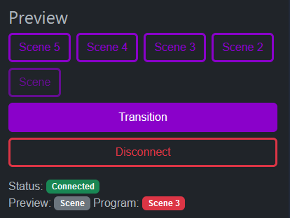

# NodeCG OBS Controller

> [!WARNING]
> This repo has been merged into https://github.com/ericthelemur/wasd

This project updates `nodcg/nodecg-obs` to OBS Websocket v5 and NodeCG 2, as well as various improvements & refactors. It also provides a React dashboard element to switch between scenes, both in and out of studio mode. 

## Installation

1. Install NodeCG
2. `git clone -b build https://github.com/ericthelemur/nodecg-obs-control`
3. Run NodeCG
